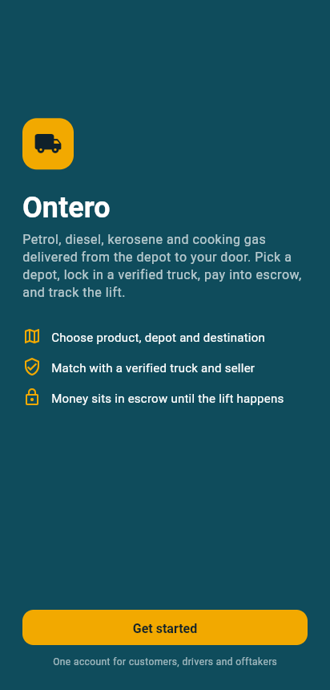
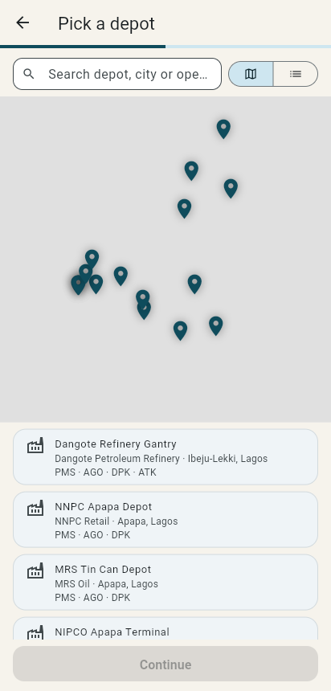
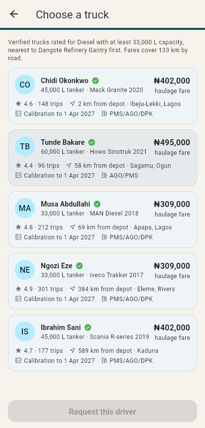
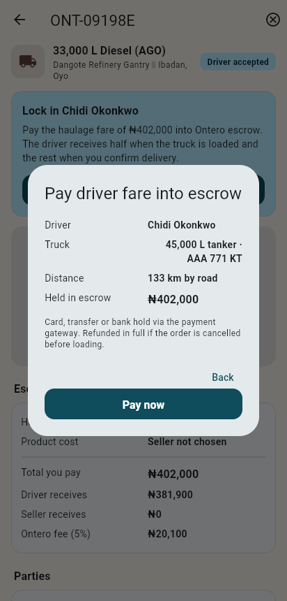
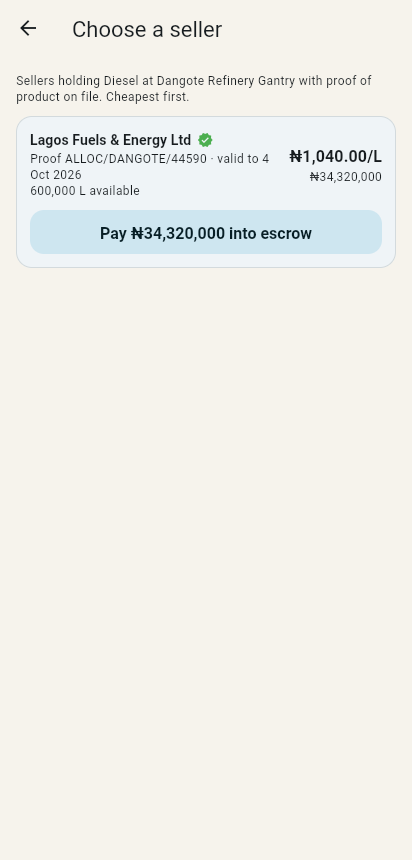
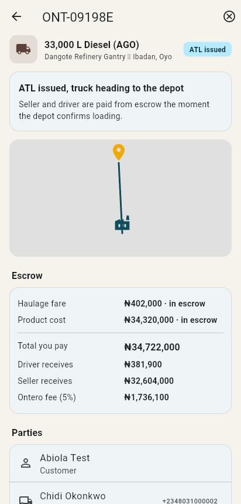

# Ontero

Ontero is an Uber-style marketplace for downstream petroleum logistics in Nigeria.
A customer picks a product, a depot to lift from and a delivery point, locks in a
verified truck, then buys the product from a verified offtaker. Every naira sits in
Ontero's escrow account until the depot actually loads the truck.

One Flutter app, three roles. Any account can switch between them:

| Role | Gate to unlock | What they do |
| --- | --- | --- |
| Customer | none | Create deliveries, fund escrow, confirm receipt |
| Driver | truck photos, calibration certificate, licence, liveness check, monthly re-check | Accept requests, load at depot, deliver |
| Offtaker (seller) | CAC registration, NMDPRA licence, proof of product per depot | List product, issue the Authority To Lift (ATL) |

## Order lifecycle

```
customer  creates order               → awaitingDriver
driver    accepts                     → driverAccepted
customer  pays haulage fare to escrow → driverFunded
customer  picks seller, pays product  → productFunded
offtaker  issues ATL on that truck    → atlIssued
driver    confirms depot loaded truck → lifted      (driver gets 50% of fare, seller gets 100% of product, less 5% fee each)
driver    confirms discharge          → delivered
customer  confirms receipt            → completed   (driver gets remaining 50%)
```

Cancelling before the lift refunds everything held in escrow. Nothing can be
cancelled once product is loaded. The state machine and payouts live in
`lib/state/providers.dart` and are covered by `test/order_flow_test.dart`.

## Project layout

```
lib/
  app/            theme and go_router routes
  core/models/    Product, Depot, Truck, AppUser (+DriverProfile, OfftakerProfile, ProofOfProduct), ProductListing, Order, Atl, LedgerEntry
  core/services/  Pricing: distance, haulage fare, 5% platform fee, release shares
  core/data/      Seed depots, drivers, offtakers and listings (Nigeria)
  state/          Riverpod notifiers: session, users, listings, orders, escrow ledger, demo simulator
  features/
    auth/         welcome, phone sign-in, OTP
    shell/        home shell with role-aware tabs and the role switcher
    customer/     order wizard (product → depot map → destination map → truck), seller picker, tracking page
    driver/       registration with photos and liveness check, monthly re-check, job board
    offtaker/     company registration, proof of product, listings, ATL issuance
    wallet/       escrow ledger per user
    profile/      roles, payout bank account
  widgets/        shared UI plus flutter_map helpers (OpenStreetMap tiles, no API key)
```

## Running it

```
cd ontero
flutter pub get
flutter run            # Android or iOS device/emulator
flutter run -d chrome  # web
flutter test
```

Sign in with any name and phone number; the OTP is not yet wired to SMS so any six
digits work. To see the other sides of an order, sign out and sign back in as one of
the seeded accounts shown on the login screen, or switch roles from the home screen
and register as a driver or seller.

### Demo simulator

There is no backend yet, so seeded drivers and sellers are played by a small
simulator (`DemoSimulator` in `lib/state/providers.dart`). It accepts requests,
issues ATLs, confirms loading and delivery on a short delay so a single phone can
walk an order from request to completion. Drivers and sellers you register yourself
are not simulated; you act for them by switching roles.

## What plugs in next

These are the seams left for production services. Each is a single class or method.

- **Auth / OTP**: `OtpScreen._verify` and `SessionNotifier.signIn`.
- **Payments and escrow**: `OrdersNotifier.fundDriverEscrow`, `fundProductEscrow` and `_release`. Paystack or Flutterwave for collection and holds, a bank transfer API for payouts to `BankAccount`.
- **Persistence and realtime**: the notifiers in `lib/state/providers.dart` are in-memory. Back them with Firestore, Supabase or a REST API and replace `DemoSimulator` with push notifications.
- **Liveness and document checks**: `LivenessCheck` captures the selfie sequence; hand the frames to a vendor (Smile ID, Dojah, Youverify) for face match and anti-spoofing. Same for licence and CAC documents.
- **Proof of product**: `ProofOfProduct` is uploaded by the seller today. Depot or NMDPRA verification of allocation references would close the loop against fake stock.
- **Maps**: tiles come from OpenStreetMap. Swap `osmTiles()` in `lib/widgets/map_widgets.dart` for Google or Mapbox if you want geocoding and routing; `Pricing.roadKm` currently uses straight-line distance times 1.3.

## Screenshots

Captured from the web build in a headless browser. Map tiles are blank in these
captures only because OpenStreetMap was unreachable from the build container.

| Welcome | Depot picker | Truck matching |
| --- | --- | --- |
|  |  |  |

| Driver escrow | Seller picker | Order tracking |
| --- | --- | --- |
|  |  |  |
